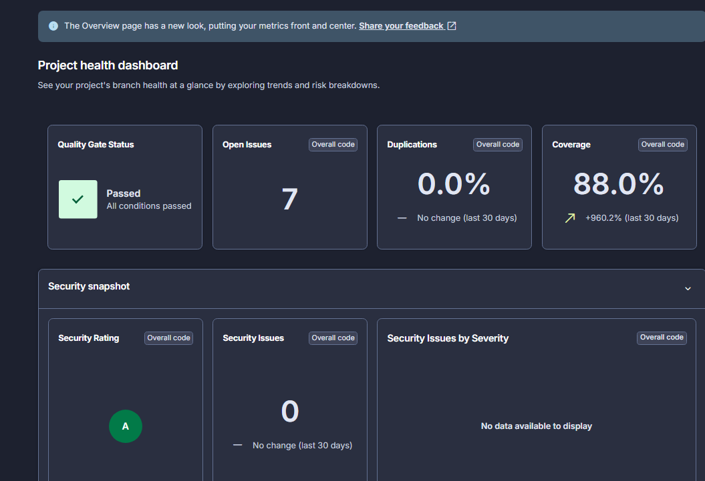
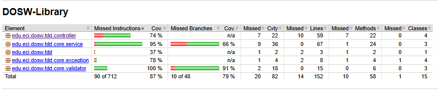
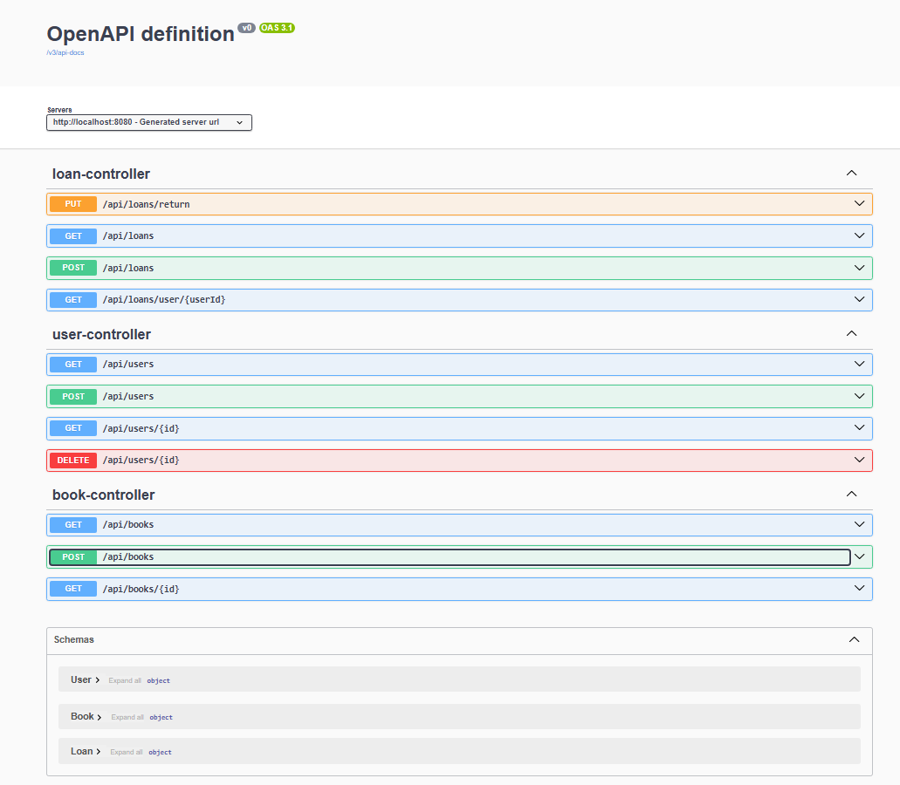
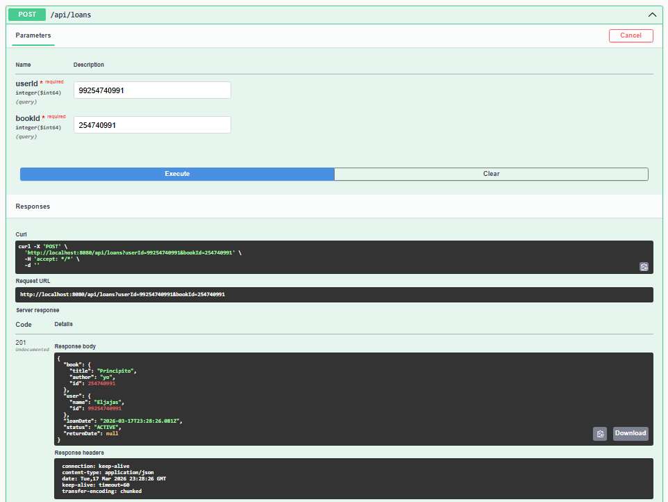
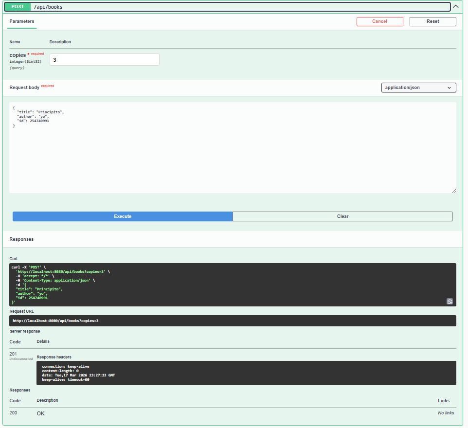
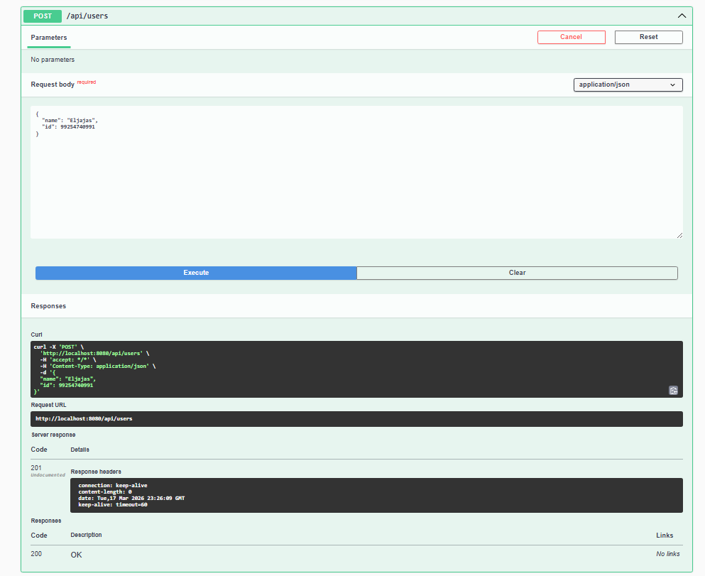
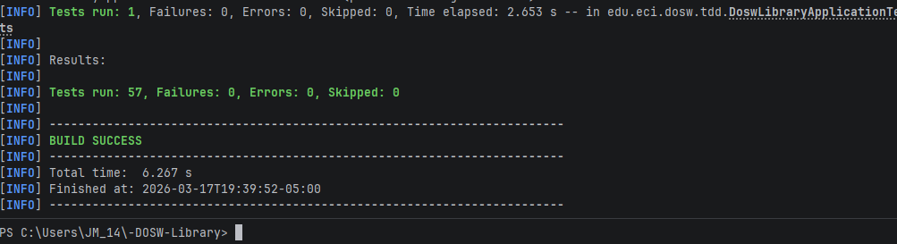

# -DOSW-Library

# Sonar 

# Jacoco

# Api

# Pruebas

# Video de prueba de seguridad y persistencia

[Prueba de persistencia  api biblioteca](https://youtu.be/FrHPrbd7iUo)

[Prueba de seguridad api biblioteca](https://youtu.be/xOu3q0nxt0k)

